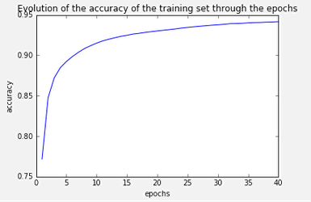

# Multilayer Neural Network - Python implementation from scratch

### Synopsis ###
This project aims to implement an Artifical Neural Network with multiple layers from scratch with Python language.
A Neural Network has this kind of structure, with one input layer (purple units), one or several hidden layers (green units) and one output layer (pink units):


Here are the main characteristics of the implemented neural network: 

* Multiple hidden layers of different sizes 
* Feedforward phase following by a backpropagation from the output layer to the input layer
* Sequential learning (weights are updated after each iteration)
* Personnalization of the activation function for the hidden layers and the output layer (by default tansig and logsig respectively)

The goal is not to obtain the lowest error rate as possible, rather to build a functional neural network.

### Results with MNIST dataset ###

The implemented neural network has been tested with the MNIST dataset (handwritten digits). The goal is to recognize digits form 0 to 9. After a training phase of 40 epochs, it gives an accuracy of 92% on the test set. The following graph shows the evolution of the accuracy of the prediciton on the training set through the epochs: it increases since the network is learning during this training phase.



### Project content ###

Content of this project: 

* folder 'network': contains modules to build the network
* folder 'data': contains data used for the training and testing phases (to be added) with modules that can be used for data preprocessing (normalization)
* Python Notebook 'ann_test': illustration of the implemented network with MNIST dataset

### Code example ###

```python
from network.ann import Network
from network.activation_function import ActivationFunction, logsig, tansig

# Creation of the network and setting of the activation function
mynetwork = Network([784, 20, 10])
mynetwork.set_activation_fct(tansig, logsig)

# Training
mynetwork.train(data_train, label_train, learning_rate=0.01, nb_epochs=100)

# Testing
mynetwork.test(data_test, label_test)
```

A complete code example is provided by the Python Notebook 'ann_test.ipynb'.

### Dependencies ###

- numpy 
- matplotlib

### Author ###

Mareva Brixy (marevabrixy@gmail.com)

