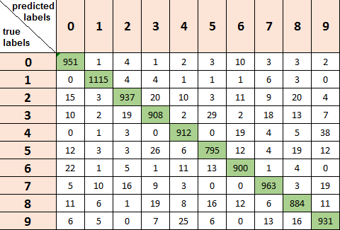

# Multilayer Neural Network - Python implementation from scratch

### Synopsis ###
This project aims to implement an Artifical Neural Network with Python language. Since there are plenty of neural network librairies, the purpose of this project is not to obtain the most efficient neural network, rather to build a functional one for a better understanding of its mechanism. I train and test the neural network I implemented with MNIST dataset.

Neural networks are really efficient tools in machine learning field whose applications are classification, regression,
features extraction, pattern recognition. A neural network is an interconnected group of nodes, whose structure and mechanism are inspired by the the neurons of human brain. The nodes of neural networks are called _neurons_ and they are organized into groups that we call _layer_. Neurons of a same layer are connected to neurons of neighbor layers but there is no connection between neurons of a same layer. Connections between neurons are all weighted. We can define 3 types of layers for classic neural networks:

* input layer: this layer contains ’input neurons’. They bring input information for all the rest of neurons.
* output layer: this layer contains ’output neurons’. They represent the output information after treatment by the neural network.
* hidden layer: this layer is located between the input layer and the output layer. It contains ’hidden neurons’. There can be several successive hidden layers of different sizes.

This structure is illustrated below, with an input layer of 2 neurons, 2 hidden layers of 3 and 4 neurons and one output layer of one neuron. 

<p align="center">
  
</p>

In a feedforward neural network, a signal arrives at the input layer, propagates into the hidden layers until it reaches the output layer to give an output that corresponds to the task that the network has to achieve: this is the feedforward phase. 
This output is compared to the expected result (label) and the corresponding error is used to update the weights of the connections: this is the backpropagation. In this way the network becomes more and more able to achieve its task.

Here are the main characteristics of the implemented neural network: 

* Multiple hidden layers of different sizes 
* Feedforward phase following by a backpropagation from the output layer to the input layer
* Sequential learning (weights are updated after each iteration)
* Personnalization of the activation function for the hidden layers and the output layer (by default tansig and logsig respectively)

### Results with MNIST dataset ###

The implemented neural network has been trained with the MNIST dataset (handwritten digits). The goal is to recognize digits form 0 to 9. I chose the following neural network structure:

- 784 input neurons (as the samples are 28x28 images)
- 1 hidden layer of 20 neurons
- 10 output neurons (as there are 10 classes)

The following graph illustrates the learning phase: the accuracy of the prediction on the training set increases through the epochs.

<p align="center">
  
</p>

After a training phase of 40 epochs, it gives an **accuracy of 92% on the test set** (the test set is still from MNIST dataset). An efficient way of analyzing the predictions made by the neural network is to use a confusion matrix: it compares the true labels of the samples of the test set and the predicted ones.

<p align="center">
  
</p>

The diagonal numbers (green) represent the numbers of samples of class _i_ that has been classified as class _i_ (correct prediction). In a given row the diagonal element is the highest, which means that most of the time the correct class is predicted!

Moreover I did another test and I wrote myself the digits 3, 6 and 8 with Paint and I asked my neural network to recognize the digits (after it has been trained for 40 epochs).

<p align="center">
  
</p>

Hopefully the neural network made the correct predictions: [3, 6, 8].

### Project content ###

Programming language: Python 

Content of this project: 

* folder 'network': contains modules to build the network
* folder 'data': contains data used for the training and testing phases (to be added) with modules that can be used for data preprocessing (normalization)
* Python Notebook 'ann_test': illustration of the implemented network with MNIST dataset

### Code example ###

```python
from network.ann import Network
from network.activation_function import ActivationFunction, logsig, tansig

# Creation of the network and setting of the activation function
mynetwork = Network([784, 20, 10])
mynetwork.set_activation_fct(tansig, logsig)

# Training
mynetwork.train(data_train, label_train, learning_rate=0.01, nb_epochs=100)

# Testing
mynetwork.test(data_test, label_test)
```

A complete code example is provided by the Python Notebook 'ann_test.ipynb'.

### Dependencies ###

- numpy 
- matplotlib

### Author ###

Mareva Brixy (marevabrixy@gmail.com)

